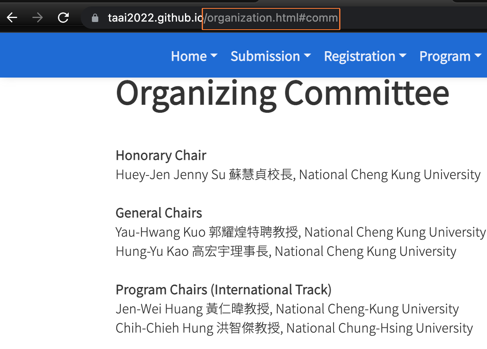
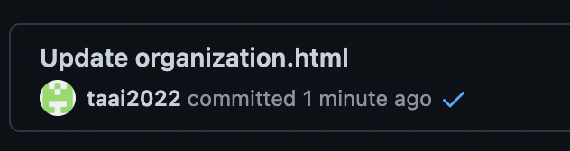

# TAAI 2022 資訊網站
This repository is forked from [taai2021](https://github.com/taai2021/cyut).

## 線上內容修改方式
1. 根據要修改的網址查到對應的html檔案名稱(如圖中舉例是organization.html檔案)
    
2. 在 https://github.com/taai2022/taai2022.github.io 專案下點擊該檔案：
    
3. 點擊編輯按鈕開啟github編輯功能
    
4. 加上要新增或修改的內容
    
5. 編輯完程後移動到頁面最底，點選commit changes，即修改完成
    
6. 可透過 commit history 查看修改上線狀態：
   - 點擊時鐘按鈕進入 commit history 頁面
       
   - 若畫面出現黃色代表還沒上傳完成
       
   - 稍等一下後，變成藍勾勾代表修改成功，可以直接在 taai2022.github.io 上確認更改的內容
       
